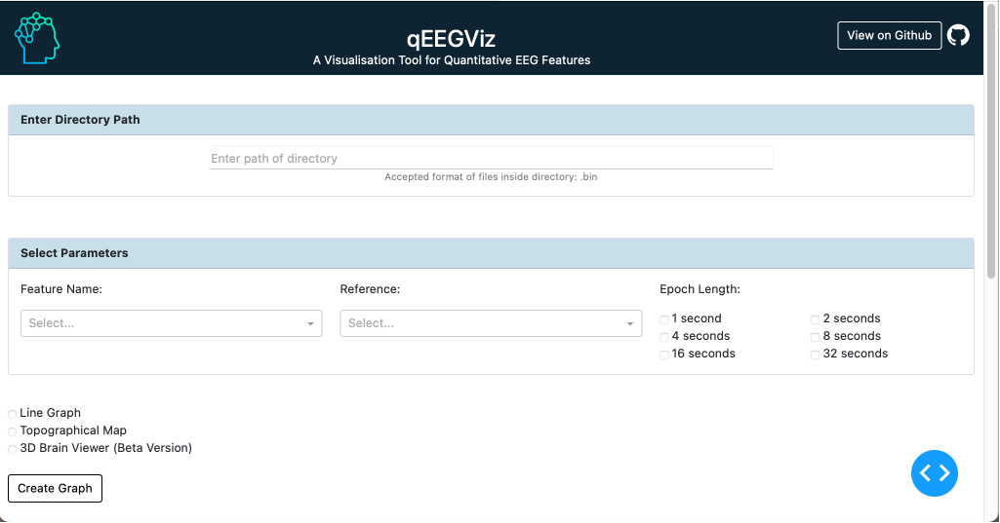
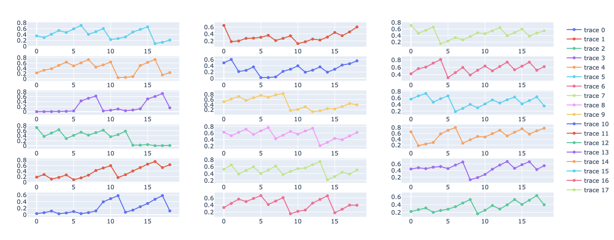

# qEEGViz - A Visualisation tool for Reliability of Quantitative EEG Features

## About this app

Reliability and validity of features are important statistical concepts used by researchers to evaluate the quality of a research and draw meaningful conclusions from a study. One of the most popular ways of evaluating the reliability is by quantifying using intra-class correlation coefficient (ICC). We aim to develop a user-friendly, interactive web application that enables scholars and researchers to visualize the reliability of quantitative EEG (qEEG) features across various subjects. This tool is an academic contribution created solely for scholars and researchers to enhance the statistical power of the EEG experiment to detect a true treatment effect.

## Dataset

The dataset used to create the visualization tool is provided by Tom Brismar from the Karolinska Institute in Stockholm (http://clopinet.com/causality/data/nolte/). Each dataset is an EEG measurement of 10 subjects with eyes closed (resting state) using 19 channels according to the standard 10-20 system. The sampling rate is 256Hz. According to the information given on the website, on dividing the data set into blocks of 4 seconds (i.e. 1024 data points) gives us a block of continuous measurement which is cleaned of apparent artifacts.

All data files are saved in .bin format under the dataset folder. The user can add his or her desired files under the same folder and visualise the reliability of quantitative EEG Features.

## How to run this app locally

Clone this repository and navigate to the directory containing this `README` in
a terminal.

Create and activate a virtual environment (recommended):

```bash
python3 -m venv myvenv
source myvenv/bin/activate  # Windows: \venv\scripts\activate
```

Install the requirements

```bash
pip install -r requirements.txt
```

Run the app. An IP address where you can view the app in your browser will be
displayed in the terminal.

```bash
python3 app.py
```

## Screenshot



## Results




