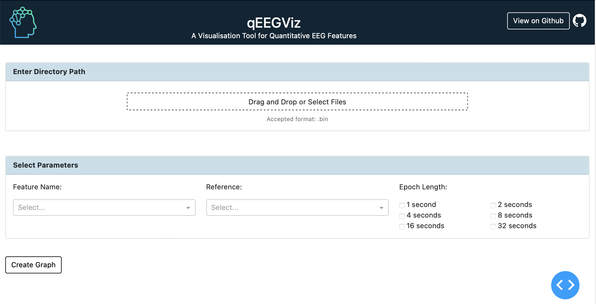
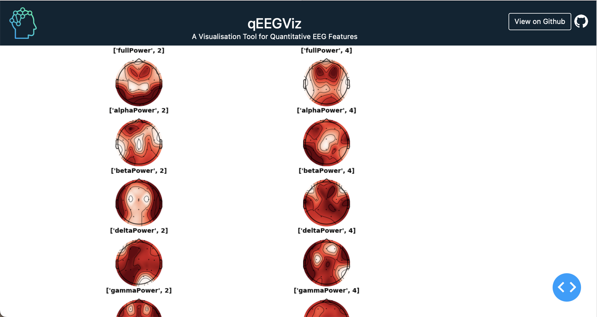

<h1 align="center"> qEEGViz - A Visualisation Tool for Reliability of Quantitative EEG Features </h1>

## About this app

An electroencephalogram (EEG) is a test that detects the electrical patterns of the brain via small metal discs (electrodes) attached at the surface of the scalp. Quantitative EEG (qEEG) is a modern type of EEG that extracts mathematical values from digital EEG using complex algorithms. Its clinical applications include dementia, epilepsy, stroke, traumatic brain injury, neuropsychiatric disorders and many more. Feature extraction is an important step in the process of EEG signal classification. An EEG or qEEG feature is said to be clinically reliable, if repeated measurements of a particular feature from a subject do not exhibit large fluctuations. This is important for researchers who are developing tools to evaluate the functional state of the brain accurately. Currently there are no applications that provide a platform to visualise the reliability of features. Here, we introduce qEEGViz, a freely accessible, easy-to-use, web-application that can be used by researchers and scholars to interactively visualise the reliability of Quantitative EEG features in multi-dimensions among various subjects, epochs lengths and electrode references.

## Dataset

The dataset used to create the visualization tool is provided by Tom Brismar from the Karolinska Institute in Stockholm (http://clopinet.com/causality/data/nolte/). Each dataset is an EEG measurement of 10 subjects with eyes closed (resting state) using 19 channels according to the standard 10-20 system. The sampling rate is 256Hz. According to the source, on dividing the data set into blocks of 4 seconds (i.e. 1024 data points) gives us a block of continuous measurement which is cleaned of apparent artifacts.

All data files are saved in ```.bin``` format under the ```dataset``` folder. The user can add his or her desired data files under the same folder and visualise the reliability of quantitative EEG Features.

## How to run this app locally

Clone this repository and navigate to the directory containing this `README` in
a terminal.

Create and activate a virtual environment (recommended):

```bash
python3 -m venv myvenv
source myvenv/bin/activate  # Windows: \venv\scripts\activate
```

Install the requirements

```bash
pip install -r requirements.txt
```

Run the app. An IP address where you can view the app in your browser will be
displayed in the terminal.

```bash
python3 app.py
```

## Results
We created a democratic platform where the user can input raw EEG signals and select the power features, electrode reference and epoch lengths according to his requirement. Finally,the web application outputs the reliability of the qEEG features in the form of topographic map. This tool is an academic contribution created solely for scholars and researchers to visualise qEEG features across the brain.

#### Input Page


#### Results for Absolute Power Features across 19 Electrodes for 2s, 4s Epochs for 10 Subjects (Default Reference)


#### Topographic Maps of Absolute Power Features across 19 Electrodes for 1s, 2s, 4s and 8s Epochs for 10 Subjects (Average Reference)


## Fututre Enhancements 
We plan to optimise the code for faster results and expand the form of visualisation by projecting the results in a 3-D Brain Viewer which can provide a clearer image and understanding of the reliability of the features. 
